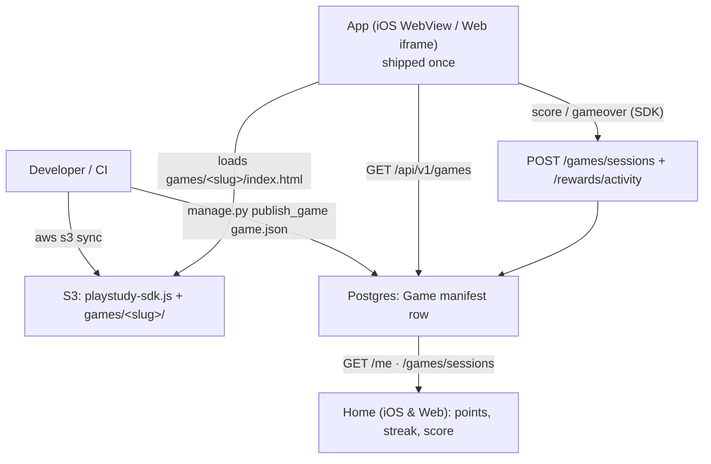

# Publishing a game to S3 — walkthrough

See `architecture.svg` for the full picture. This doc shows, with real sample
games, exactly what happens when you publish.



## A game is just a folder with an `index.html`

Every game includes the SDK (`../../playstudy-sdk.js`) and talks to
`window.PlayStudyGame`. The smallest possible game (`games/_template/`):

```html
<script src="../../playstudy-sdk.js"></script>
<script>
  var score = 0;
  PlayStudyGame.onInit(function (material) {     // material.quiz / material.words
    document.body.onclick = function () {
      score += 10;
      PlayStudyGame.score(score);                // live score -> app -> server
    };
  });
  // call PlayStudyGame.gameover(score) when the round ends
</script>
```

Three working examples ship in `games/`:

| Folder | Uses | Mechanic |
|--------|------|----------|
| `quiz-rush/`  | `quiz`  | beat-the-clock multiple choice |
| `true-false/` | `quiz`  | is the shown answer right? |
| `word-pop/`   | `words` | tap the word matching the clue |

## Publishing (no App Store release)

```bash
# 1. upload the SDK (once) + the game folder
aws s3 sync games_host/ s3://$GAMES_BUCKET/ --exclude "*.md" --exclude "*.svg"

# 2. add the catalog row
python manage.py publish_game apps/games/examples/word_pop.json
```

### What the app does in reaction

1. On next launch it calls `GET /api/v1/games`, sees the new row, and registers
   a card for it (`RemoteWebGame`). **No app change.**
2. The card appears wherever games are listed — the **Home games strip**, the
   **Library**, and a study set's **Games tab** — filtered by `requires` (e.g.
   Word Pop only shows on sets with ≥ 2 words).
3. Tapping it opens `GameHostView`, which loads
   `{GAMES_BASE_URL}/games/word-pop/index.html` in a WebView (iOS) or iframe
   (web) and hands the game the study set's words via the SDK.
4. Editing the game later = re-upload to S3; the new code runs on next open.
   Bad game? Set `enabled=false` (admin or `publish_game`) — gone instantly.

## Keeping track of the score

- The game calls `PlayStudyGame.score(n)` and `PlayStudyGame.gameover(final)`.
- The app records it on the play session (`POST /games/sessions/.../complete`)
  and awards capped points (`POST /rewards/activity`).
- Both write to Postgres — the **single source of truth**.
- Any platform reads it back on open (`GET /me` for points/streak,
  `GET /games/sessions` for per-game history), so a score earned on iOS shows
  on web and vice-versa.
